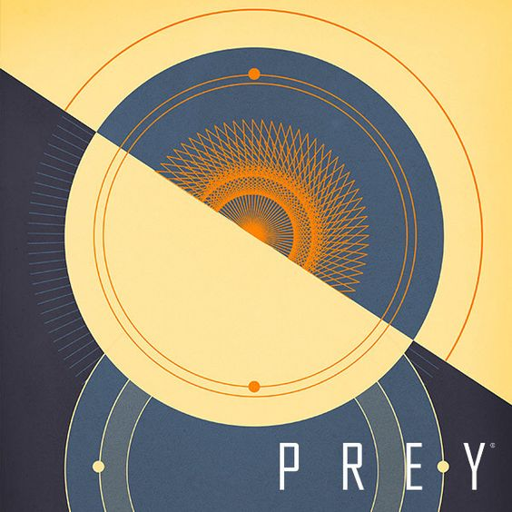

# zden9056_9103_tut5

# This is the art work I choose as inspiration

# This is another Image

These artworks incorporate lines and circles set against a clean backdrop, offering ample space for my coding pursuits. Ps.js proves to be a superb tool for creating these artworks, effortlessly generating shapes like lines, circles, and rectangles. Furthermore, JavaScript can employ techniques like loops and randomness for the project. Additionally, the concept of layers remains equally vital, as some shapes like circle and moon, are above the lines. Besides that, some animation effect can also be added to make the artwork more interesting.

